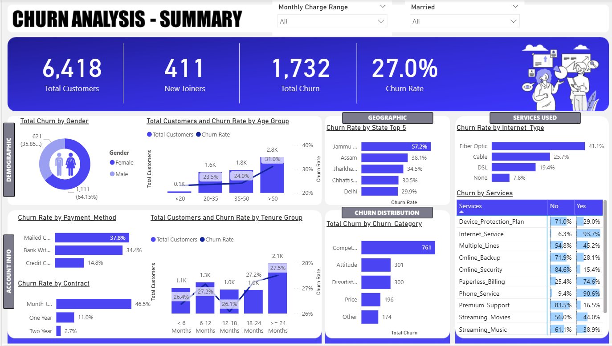
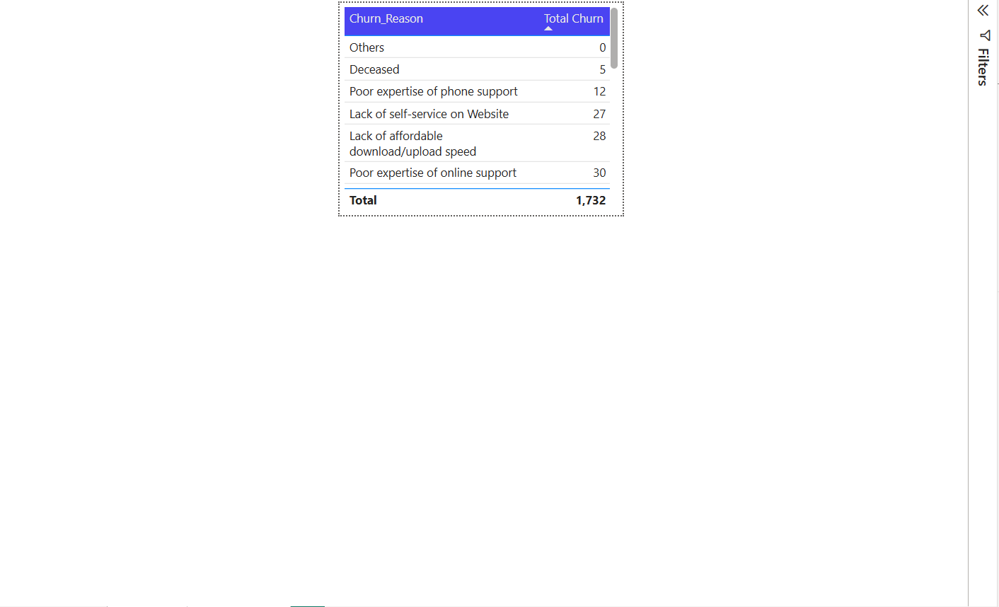

# 📊 Customer Churn Analysis (Power BI + SQL)

## 📌 Project Overview

This project focuses on analyzing customer churn behavior using Power BI and SQL.
The objective is to identify key reasons behind customer churn and provide actionable insights to improve customer retention.

---

## 🛠️ Tech Stack

* 📊 Power BI (Dashboard & Data Visualization)
* 🧠 DAX (Measures & KPIs)
* 🗄️ SQL (ETL & Data Transformation)
* 📂 Excel (Raw Data Source)

---

## ⚙️ Data Processing Workflow

1. Imported raw customer data from Excel into SQL
2. Performed ETL operations (data cleaning, transformation) using SQL
3. Loaded processed data into Power BI
4. Applied Power Query transformations
5. Created DAX measures for business insights

---

## 📊 Key Insights from Dashboard

### 🔍 Churn Reasons Analysis

* Poor expertise of online support is one of the top churn drivers
* Lack of affordable download/upload speed significantly impacts churn
* Customers also churn due to poor phone support experience
* Website self-service limitations contribute to customer dissatisfaction

---

## 📸 Dashboard Preview



---

## 📈 Business Impact

* Identifies major service gaps affecting customer retention
* Helps businesses improve customer support quality
* Enables data-driven decision-making for reducing churn

---

## 📁 Project Structure

```
customer-churn-analysis-powerbi/
│
├── Dashboard/
│   └── Churn Analysis.pbix
│
├── Data/
│   └── Customer_Data.xlsx
│
├── SQL/
│   ├── Churn SQL Queries.sql
│   └── SQL Queries.doc
│
├── PowerBI/
│   └── Power Query Transformations and Measures.pdf
│
├── Screenshots/
│   └── Dashboard_Overview.png
│
└── README.md
```


## 💡 Key Learnings

* Hands-on experience with SQL-based ETL processes
* Building interactive dashboards in Power BI
* Creating advanced DAX measures
* Translating raw data into business insights

---

## 🔗 Connect with Me

* LinkedIn: www.linkedin.com/in/shivamsingh14u

* Gmail: shivam.singh7897a@gmail.com

---

⭐ If you found this project useful, consider giving it a star!
